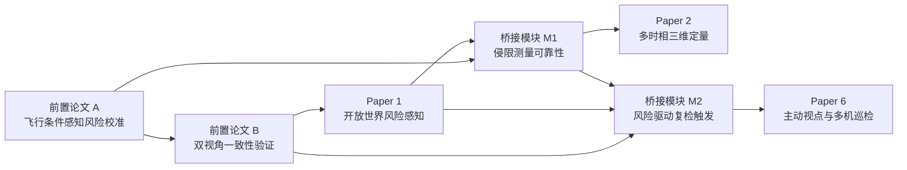

# 博士研究框架修订案（2026-08-28）

## 1. 修订效力

本文件是当前研究框架的顺序与边界修订案。2026-08-28 以前各项目文件中，凡与本文件在“当前活动任务、启动顺序、模块边界、接口依赖”方面冲突的表述，以本文件为准；原文件继续作为历史记录保留。

本次修订不改变博士研究总主线：

> 面向铁路无人机巡检与应急任务，研究通信约束、风险驱动与不确定性感知条件下的感知、测量、复检和多机决策。

## 2. 修订后的研究链

Paper 3、4、5、7的研究定位不变，本轮不启动，也不要求前置论文承担其证据任务。

## 3. 当前项目状态

| 层级 | 项目 | 当前状态 | 启动条件 |
|---|---|---|---|
| 1 | 前置论文 A | **唯一活动任务** | 已启动，学习计划从零重新计时 |
| 2 | 前置论文 B | 排队 | A完成核心实验并冻结输出接口 |
| 3 | Paper 1 | 暂停主体实现，仅保留接口设计 | A、B完成投稿或达到内部投稿标准 |
| 4 | 桥接模块 M1 | 阻塞 | Paper 1风险与未知候选接口稳定 |
| 5 | Paper 2初步研究 | 阻塞 | M1能够输出有效测量区间 |
| 6 | 桥接模块 M2 | 阻塞 | Paper 1与M1接口稳定，具备配对复检数据 |
| 7 | Paper 6 | 阻塞 | M2完成“是否复检”的触发接口 |

任何时刻只允许一个项目处于“唯一活动任务”状态。文献预读可以提前进行，但不得形成并行实验线。

## 4. 四项新增成果的职责边界

### 前置论文 A

- 只研究封闭集已知障碍的概率与风险校准；
- 使用高度、云台角度、像素尺寸、模糊度和轨道相对位置；
- 允许输出“观测是否适合后续测量”的代理标志；
- 不研究未知目标、开放集识别和物理侵限距离。

### 前置论文 B

- 使用已经获得的两个固定视角；
- 研究轨道坐标对齐、一致性与不确定性加权融合；
- 仅保留“高风险且首次观测不可靠则固定复检”的简单规则；
- 不研究复检价值、成本优化、候选视点和航迹规划。

### 桥接模块 M1

- 接收Paper 1的已知与未知候选；
- 传播目标、轨道、相机、姿态和定位误差；
- 输出侵限距离区间、侵限概率及测量有效性；
- 不研究稠密三维、多时相变化、体积或沉降，这些属于Paper 2。

### 桥接模块 M2

- 接收Paper 1风险/认知不确定性和M1测量区间；
- 显式考虑复检的时间和能耗，回答“是否值得复检”；
- 不回答“去哪里看、如何到达、由哪架无人机执行”，这些属于Paper 6。

## 5. 对原七篇论文框架的影响

| 原论文 | 本次修订 | 保留的核心创新 |
|---|---|---|
| Paper 1 | 前置论文A、B作为方法与实验训练；Paper 1延后 | 未知候选、开放世界风险、不确定性感知 |
| Paper 2 | M1提供可靠测量入口 | 三维重建、多时相配准、变化与灾害定量 |
| Paper 3 | 无修改 | 通信约束下协同风险感知 |
| Paper 4 | 无修改 | 风险驱动ISAC |
| Paper 5 | 无修改 | 多模态风险理解 |
| Paper 6 | M2先解决是否复检 | 主动视点、航迹、多无人机执行 |
| Paper 7 | 无修改 | 通信/感知约束下多无人机决策 |

前置论文A、B必须能独立投稿，但不得把Paper 1的开放世界创新提前消耗；M1、M2默认是模块，只有通过独立论文门槛后才另行投稿。

## 6. 统一接口顺序

1. A冻结：`known_class_probability, calibrated_risk, view_uncertainty, normalized_track_position, observation_valid`。
2. B冻结：`first_risk, revisit_risk, coordinate_consistency, fused_risk, conflict_flag`。
3. Paper 1替换/扩展为：`known_or_unknown, open_world_risk, epistemic_uncertainty, object_and_track_region_id`。
4. M1增加：`longitudinal_position, lateral_offset, clearance_interval, encroachment_probability, measurement_valid`。
5. M2增加：`reinspection_priority, expected_risk_reduction, trigger, stopping_reason`。
6. Paper 2和Paper 6只调用已经冻结的上游接口，不反向改写前置论文问题。

## 7. 投稿门槛

所有候选期刊在实际投稿前重新核验：当年JIF大于2.0、最新中科院大类及所有小类均为三区或以上、2020–2025预警名单未出现、学校认可SCIE及分区、Aims & Scope直接匹配。

Drones与International Journal of Rail Transportation目前仅作为工作候选，不视为已完成最终核验。

## 8. 变更控制

只有在当前项目达到退出门槛后，才允许激活下一项目。每次切换必须更新：项目状态、接口版本、实验登记表、数据版本和一页式结论记录。
