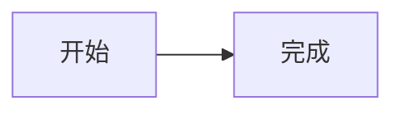
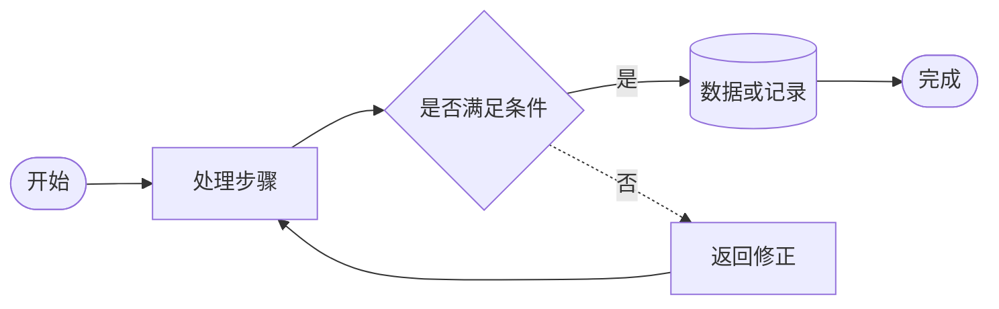
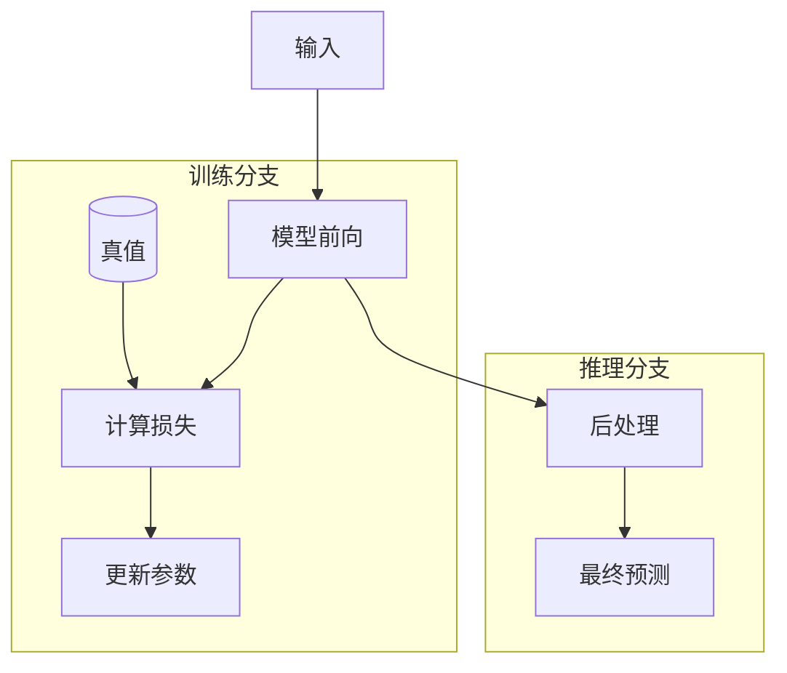
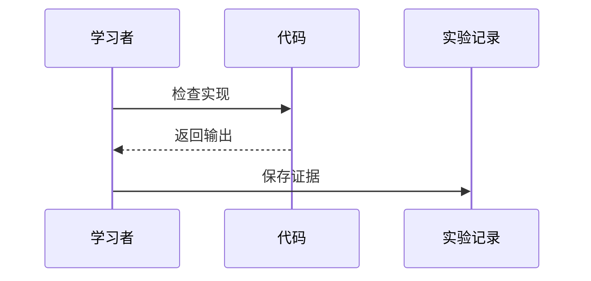
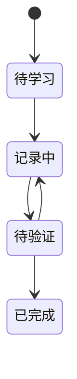

# Mermaid画图语法指南

_这里只保留完成本项目知识链、结构、流程和分支图最常用的少量语法；需要什么就查什么，不按比例学习。_

---

## 🎯 最小使用方法

Mermaid代码放在Markdown代码块中：





- `flowchart LR`：从左到右
- `flowchart TB`：从上到下
- 节点ID使用英文或拼音，如`input_image`
- 方括号中的文字是图上显示的内容
- 每行写一条连接，先画主链，再补分支

## 📚 常用节点与连线



| 用途 | 写法 |
|---|---|
| 普通步骤 | `step[处理步骤]` |
| 开始或结束 | `start_node([开始])` |
| 判断 | `decision{是否满足}` |
| 数据或记录 | `data[(实验记录)]` |
| 实线箭头 | `a --> b` |
| 带文字箭头 | `a -->|输出| b` |
| 虚线关系 | `a -.-> b` |
| 无箭头连接 | `a --- b` |

## 🔗 知识链模板


## 🗂️ 分组与分支模板



## ⚙️ 让图更清楚

- 换行：`node[第一行<br/>第二行]`
- 连线命名：`a -->|特征| b`
- 节点分类：先写`classDef`，再写`class node_id class_name`
- 注释：`%% 这一行不会显示`
- 复杂图拆成“总览图＋局部图”

每张支持可访问性字段的图建议加入：

```text
accTitle: 3到8个词的图名
accDescr: 一句话说明这张图展示什么关系
```

不要使用`%%{init}`主题指令或`style node ...`内联样式；需要颜色时使用`classDef`。

## ✍️ 其他常用图类型

### 时序交互



### 状态变化



## 🚫 常见错误

- 节点ID含空格：错误`input image`，正确`input_image`
- 把保留字`end`直接作为节点ID
- 一张图节点过多仍不分组
- 用很长的句子作为节点文字
- 只靠颜色表达含义
- 代码块没有写语言标识`mermaid`

## 🔍 怎么检查

1. 先只画3—6个节点的主链
2. 确认能渲染后再增加分支
3. 检查箭头是否表达因果或数据流
4. 检查每个节点是否能在正文找到解释
5. 可粘贴到[Mermaid Live Editor][mermaid-live]预览

[mermaid-live]: https://mermaid.live/ "Mermaid Live Editor"
